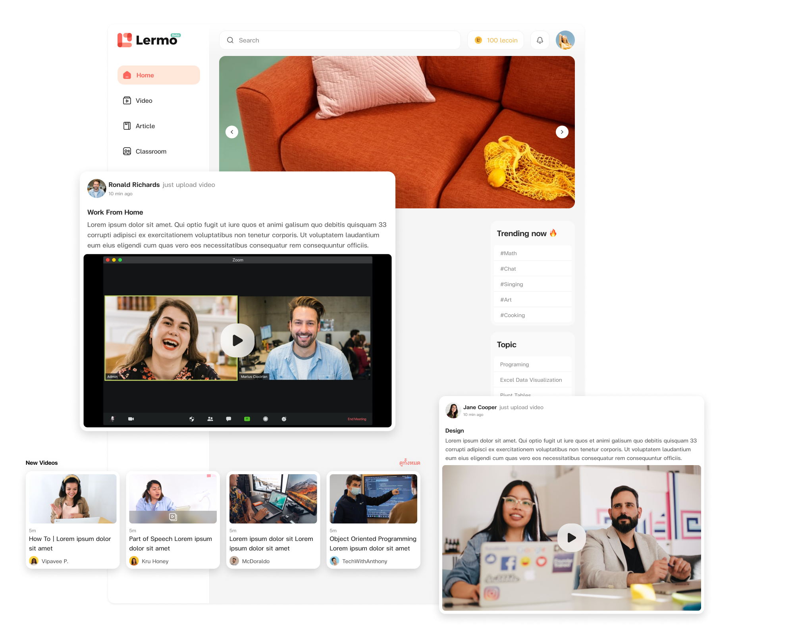

# Lermo: Social Learning Network



Lermo is a social platform for education that aims to create a vibrant learning community. It combines the concepts of social media platforms and communication tools to provide an interactive and collaborative learning experience.

# Get Started

## Local environment
```
docker-compose up
```

## Kubenetes
```
helm install lermo-sln ..... 
```

# Features

Lermo offers a range of features designed to enhance the learning process and foster engagement within the community. Some of the key features include:

1. Chat: Connect and communicate with fellow learners through various channels such as group chat, video conferences, and voice chat. Collaborate in real-time and exchange ideas effortlessly.

2. Learning: Access a personalized learning feed, where you can share posts, educational videos, and even host live streams. Stay updated with the latest learning materials and never miss out on valuable content.

# Use Cases

Lermo is a versatile social learning network that can be utilized in various settings to enhance the learning experience and create a collaborative environment. Here are some of the common use cases:

1. Learning Community: Lermo provides a platform for creating learning communities where individuals with similar interests or goals can gather, share knowledge, and engage in discussions. Whether it's a community focused on a specific subject, a hobby, or a profession, Lermo enables learners to connect and collaborate effectively.

2. Classroom: Lermo can be used as a virtual classroom, enabling educators and students to interact, share resources, and engage in real-time discussions. Teachers can create groups, post assignments, and deliver lectures through video conferences or live streams. Students can actively participate, ask questions, and collaborate with their peers.

3. Small Group Learning: Lermo is ideal for facilitating small group learning activities. Students working on group projects, study circles, or research collaborations can utilize Lermo's chat and video conference features to communicate, exchange ideas, and work together seamlessly. This fosters greater interaction and enhances the effectiveness of small group learning.

4. Learning Management System (LMS): Lermo can be integrated as a social layer in existing Learning Management Systems. By incorporating Lermo's features, such as group chat, video conferencing, and content sharing, an LMS can promote better engagement and collaboration among learners. Lermo enhances the social and interactive aspects of online learning platforms.


# Free and Open for Everyone

At Lermo, we believe in making education accessible to all. That's why our software is completely free and open-source for everyone to use. We aim to democratize education and provide equal opportunities for all learners.


# Business Model

While Lermo is provided free of charge, we offer additional support and infrastructure services for a nominal fee. This allows us to maintain the quality and functionality of the platform while keeping it accessible to as many users as possible.

By charging for support and infrastructure, we can ensure that Lermo remains easy to deploy and maintain, providing a seamless experience for users at an affordable price point.


# Geting Started

## Local environment
```
# API
https://github.com/LERM0/lermo-sln-api

# Web
https://github.com/LERM0/lermo-sln-web
```

## Kubenetes (Inprogress)
```
helm install lermo-sln ..... 
```

# Support Us

We appreciate your support for our project! Here are the different ways you can contribute, sponsor, or invest in our initiative:

Contributor: We are currently building a small group of contributors for this project as it is still in its initial stages. We welcome individuals who are interested in joining our team and contribute to the development and improvement of this project. Please reach out to us at contact@lermo.io to express your interest and discuss potential contributions.

Sponsorship: We are planning to utilize platforms such as Github Sponsors, Patreon, and buymeacoffee to gather financial support for this project. Your sponsorship will greatly assist us in furthering our mission of changing the education system. Stay tuned for more information on how you can sponsor and support our project through these platforms.

Investor: We welcome investors who share our vision and understand the mission of our project. While we value financial support, it is important for us to work with investors who align with our purpose rather than solely focusing on monetary gains. If you are an investor who sees the value in what we are doing and believes in our mission of transforming the education system, we would be delighted to discuss potential collaborations. Please contact us at contact@lermo.io 

# Lermo Mission

"Picture a groundbreaking education system that transcends barriers, offering boundless access to knowledge for all. It embodies inclusivity and equality, empowering learners worldwide to embrace their potential and pursue dreams without constraints. In this educational utopia, knowledge fuels curiosity, ignites intellect, and fosters a love for learning, shaping a brighter, enlightened future for humanity. Let's dare to envision and strive for an education system that belongs to everyone—a beacon of hope and empowerment, inspiring generations to flourish and make a positive impact."

